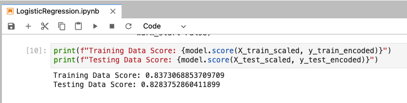

# Machine Learning Homework - Exoplanet Exploration

## Background

Over a period of nine years in deep space, the NASA Kepler space telescope has been out on a planet-hunting mission to discover hidden planets outside of our solar system.

To help process this data, you will create machine learning models capable of classifying candidate exoplanets from the raw dataset.

- - -

## Steps to Creating the Models

### Preprocess the Data

* Preprocess the dataset prior to fitting the model.
* Perform feature selection and remove unnecessary features.
* Use `MinMaxScaler` to scale the numerical data.
* Separate the data into training and testing data.

### Tune Model Parameters

* Use `GridSearch` to tune model parameters.
* Tune and compare at least two different classifiers.

- - -

## Results

* Logistic Regression before Tuning

* Logistic Regression after Tuning

* Support Vector Machine (SVM) before Tuning

* Support Vector Machine (SVM) after Tuning

* Deep Learning Model

* Overall, the accuracy of both Logistic Regression model and Support Vector Machine (SVM) model improved after tuning by GridSearch (from about 0.83 to about 0.87 on both models), but Deep Learning model still has the best accuracy out of three models without any tuning (about 0.90). This happens due to Deep Learning model used more than one layer of hidden nodes. However, it would be interesting to see if/how-many epochs of the neural network in the Deep Learning model it would take to achieve a better accuracy and help the model better to predict new exoplanets.

- - -

## Resources

* [Exoplanet Data Source](https://www.kaggle.com/nasa/kepler-exoplanet-search-results)

* [Scikit-Learn Tutorial Part 1](https://www.youtube.com/watch?v=4PXAztQtoTg)

* [Scikit-Learn Tutorial Part 2](https://www.youtube.com/watch?v=gK43gtGh49o&t=5858s)

* [Grid Search](https://scikit-learn.org/stable/modules/grid_search.html)

